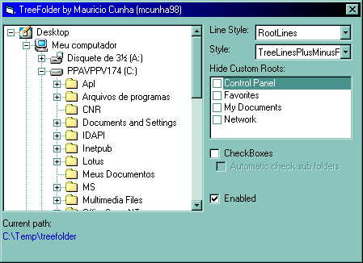



## TreeFolder \- Real Folders to TreeView

### Description

This is a standard component based in TreeView of Microsoft Common Controls. It show true icons for all folders, have options to show/hide standard roots (like My Documents, Network, etc...)

Is very faster using the LockWindowApi and another APIs. Exist a little bug in the background color propertie for users of Common Controls 2.0, in the future i fix this bug.
 
### More Info
 

             |
---                |---
**Submitted On**   |2006-02-20 11:50:48
**By**             |[Mauricio Cunha](https://github.com/Planet-Source-Code/PSCIndex/blob/master/ByAuthor/mauricio-cunha.md)
**Level**          |Intermediate
**User Rating**    |3.8 (15 globes from 4 users)
**Compatibility**  |VB 5\.0, VB 6\.0
**Category**       |[Custom Controls/ Forms/  Menus](https://github.com/Planet-Source-Code/PSCIndex/blob/master/ByCategory/custom-controls-forms-menus__1-4.md)
**World**          |[Visual Basic](https://github.com/Planet-Source-Code/PSCIndex/blob/master/ByWorld/visual-basic.md)
**Archive File**   |[TreeFolder1974912202006\.zip](https://github.com/Planet-Source-Code/mauricio-cunha-treefolder-real-folders-to-treeview__1-64396/archive/master.zip)

